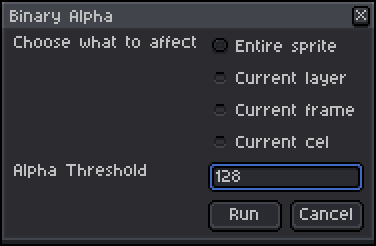
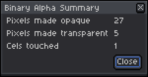

# binalpha

Aseprite script which makes near-transparent pixels fully transparent and near-opaque pixels fully opaque.

In affected cels, any pixel the alpha value of which is less than **Alpha Threshold** will have its alpha set to 0. All other pixels will have their alpha set to 1.

After clicking `Run`, a summary dialog gives information about what the operation did. The script properly registers an Undo entry.

## Installation

Download `binary_alpha.lua` and put it in your scripts directory as revealed by `File -> Scripts -> Open Scripts Folder`, then choose `File -> Scripts -> Rescan Scripts Folder`, then run the script from `File -> Scripts`.
